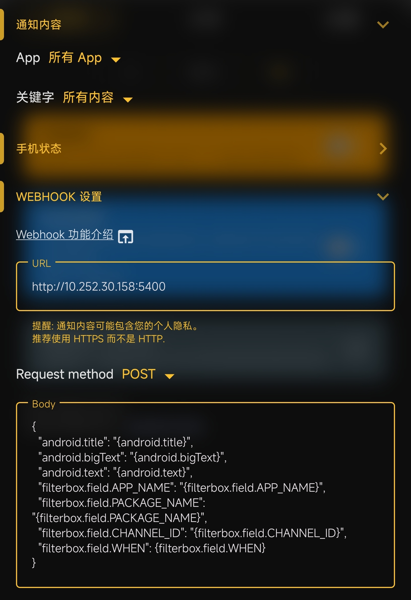

# Notify Mac Webhook


基于 `通知滤盒 Filter Box` 应用的 `Webhook` 通知脚本。

## MacOS App

- https://github.com/julienXX/terminal-notifier

```shell
brew install terminal-notifier
```

## Android App

- https://play.google.com/store/apps/details?id=com.catchingnow.np
- https://store.lizhi.io/site/products/id/316

```json
{
  "android.title": "{android.title}",
  "android.bigText": "{android.bigText}",
  "android.text": "{android.text}",
  "filterbox.field.APP_NAME": "{filterbox.field.APP_NAME}",
  "filterbox.field.PACKAGE_NAME": "{filterbox.field.PACKAGE_NAME}",
  "filterbox.field.CHANNEL_ID": "{filterbox.field.CHANNEL_ID}",
  "filterbox.field.WHEN": {filterbox.field.WHEN}
}
```

### Screenshot



## License

[Apache License 2.0](./LICENSE)
